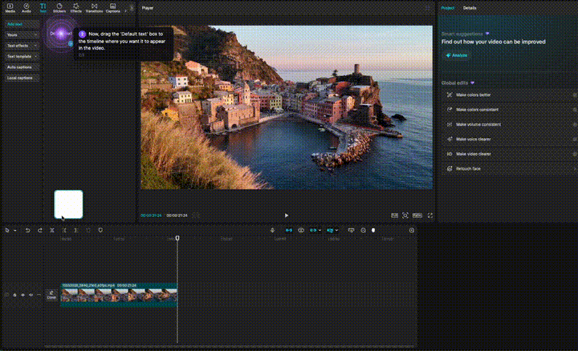

# OraAI

A floating AI screen companion for macOS and Windows. It follows your cursor, listens to your voice, sees your screen, and then moves to show you exactly what to click.

<p align="center">
  
</p>

## What it does

You hold Alt+Space and ask something like "how do I add text to this video?" — OraAI takes a screenshot, sends it to a vision AI, and then the orb detaches from your cursor and floats to the exact button you need to press. It talks you through each step.

**New: Agent Mode** — toggle it on in the tray menu and OraAI will actually *click, type, and navigate* for you, not just point. Say "open Safari and search for the weather" and watch it happen.

It works in any app. Firefox, CapCut, Calendar, VS Code, Blender — whatever you have open.

## How it works

OraAI has three modes:

- **Agent mode** (macOS, toggle in tray) — reactive loop: screenshot → AI decides next action → orb moves → clicks/types/scrolls → new screenshot → repeat. Uses CGEvent to simulate real mouse/keyboard input. Works on any macOS app even without Accessibility permission.
- **Vision mode** (all platforms) — screenshots your screen, downscales to 1280px, sends to Claude Sonnet which returns exact coordinates. Works with any app on any platform.
- **Pixel-perfect mode** (macOS only, optional) — uses the macOS Accessibility API to read every button, text field, and menu item with exact positions. The AI just picks *which* element to click. Zero coordinate guessing.

## The orb states

- **Idle** — soft purple glow, follows your cursor
- **Listening** — warm amber pulse with expanding rings (recording your voice)
- **Thinking** — color-cycling spinner (transcribing + screenshotting + querying AI)
- **Guiding** — bright purple/gold, detaches from cursor, moves to targets with particle trail. In Agent Mode, the orb moves to each target before performing the action (click, type, etc.)
- **Agent Mode active** — orb performs real clicks and keystrokes on your screen. Press Alt+Space again to cancel at any time.

## Quick install

Download the latest zip for your platform from [Releases](https://github.com/adiKhan12/OraAi/releases).

### macOS
1. Unzip and drag `OraAI.app` to Applications
2. Add your API keys — open Terminal and run:
   ```bash
   mkdir -p ~/.oraai
   nano ~/.oraai/.env
   ```
   Paste and save:
   ```
   OPENROUTER_API_KEY=your-key-here
   ELEVENLABS_API_KEY=your-key-here
   ```
3. First launch: macOS may block it — go to **System Settings → Privacy & Security**, click **"Open Anyway"**
4. Grant Microphone and Screen sharing when prompted
5. **Alt+Space** to talk

### Windows
1. Unzip the folder anywhere
2. Create the config folder and `.env` file — open Command Prompt and run:
   ```
   mkdir %USERPROFILE%\.oraai
   notepad %USERPROFILE%\.oraai\.env
   ```
   Paste and save:
   ```
   OPENROUTER_API_KEY=your-key-here
   ELEVENLABS_API_KEY=your-key-here
   ```
3. Run `OraAI.exe`
4. Grant Microphone when prompted, share your screen
5. **Alt+Space** to talk

Get API keys from [OpenRouter](https://openrouter.ai) and [ElevenLabs](https://elevenlabs.io).

## Build from source

```bash
git clone https://github.com/adiKhan12/OraAi.git
cd OraAi
npm install
```

Add your API keys:
```bash
mkdir -p ~/.oraai
nano ~/.oraai/.env
```

Run in dev mode:
```bash
npm start
```

Build for macOS (includes pixel-perfect accessibility helper):
```bash
swiftc -O -o helpers/ax-elements helpers/ax-elements.swift -framework Cocoa
npm run build
```

## Optional: Pixel-perfect mode (macOS only)

OraAI works out of the box using AI vision. For pixel-perfect accuracy on macOS, enable Accessibility:

1. **System Settings → Privacy & Security → Accessibility**
2. Click **"+"** and add `OraAI.app`
3. Toggle it **ON**

This lets OraAI read every UI element directly from macOS — no coordinate guessing.

## Agent Mode (macOS)

Right-click the tray icon and toggle **Agent Mode (auto-click/type)** ON. Now when you speak a command, OraAI will actually perform the actions — clicking buttons, typing text, pressing keys, and scrolling — instead of just pointing at them.

- Works with **any** macOS app — uses CGEvent at the OS level, no Accessibility permission needed
- Reactive loop: takes a screenshot after each action so it always knows the current screen state
- Max 15 steps per query — cancel anytime with Alt+Space
- For pixel-perfect clicking on apps that support Accessibility, enable the optional Accessibility permission above

> **Windows note:** Agent Mode is macOS-only for now. Vision mode (point-and-guide) works on Windows. Windows Agent Mode support coming in a future release.

## Platform support

| Platform | Vision mode | Pixel-perfect mode | Agent Mode |
|----------|------------|-------------------|------------|
| **macOS** | Works out of the box | Enable Accessibility permission | Toggle in tray menu |
| **Windows** | Works out of the box | Coming soon | Coming soon |

## Tech stack

- Electron (transparent overlay window)
- HTML Canvas (orb rendering + animations)
- Claude Sonnet via OpenRouter (vision + coordinate extraction)
- macOS Accessibility API via Swift helper (optional pixel-perfect mode)
- CGEvent Quartz via Swift helper (agent mode input simulation — click, type, scroll)
- ElevenLabs (speech-to-text + text-to-speech)

## Limitations

- Ultrawide monitors (3440x1440+) may have less accurate coordinates in vision mode
- Apps with poor accessibility support (like Firefox, Spotify, Electron apps) use vision mode — most models besides Claude Sonnet give off coordinates in this mode. Claude Sonnet is recommended for best accuracy.
- Needs API keys for OpenRouter and ElevenLabs

## Inspiration

Inspired by [Clicky by Farza Majeed](https://www.linkedin.com/posts/farza-majeed-76685612a_i-built-this-thing-called-clicky-its-an-activity-7447137675658244096-Ac9B/) — I saw the concept and wanted to build my own version with a different approach.

## License

[CC BY-NC 4.0](https://creativecommons.org/licenses/by-nc/4.0/) — free to use, modify, and share for non-commercial purposes. Commercial use requires permission from the author.
